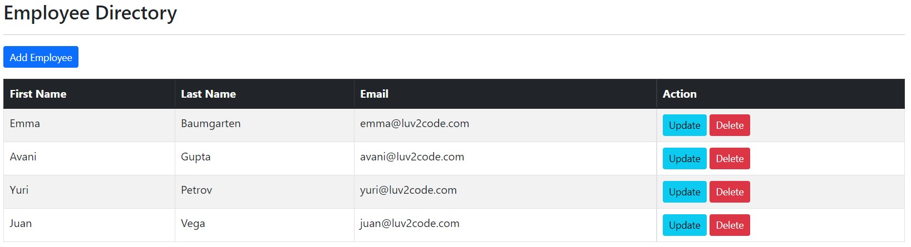
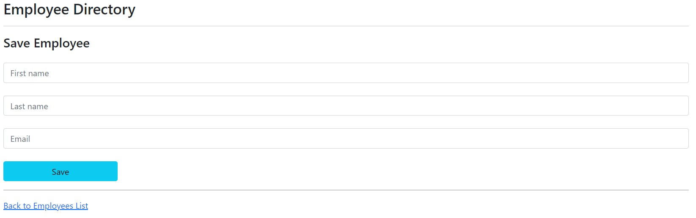
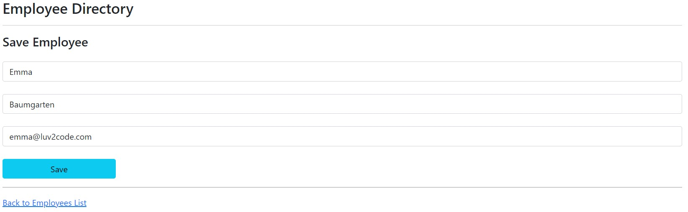
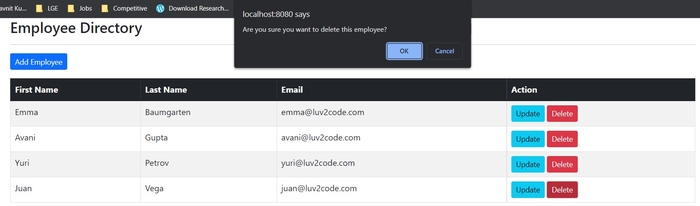

# Introduction
- Basic CRUD project to handle employees, based on `Springboot`,`Hibernate-JPA` and `MySQL`. 
- Frontend based templating is done with the help of `Thymeleaf`.  
- Starter SQL scripts used are provided here. 

## SQL Script Used 
```sql
CREATE DATABASE  IF NOT EXISTS `employee_directory`;
USE `employee_directory`;

--
-- Table structure for table `employee`
--

DROP TABLE IF EXISTS `employee`;

CREATE TABLE `employee` (
  `id` int(11) NOT NULL AUTO_INCREMENT,
  `first_name` varchar(45) DEFAULT NULL,
  `last_name` varchar(45) DEFAULT NULL,
  `email` varchar(45) DEFAULT NULL,
  PRIMARY KEY (`id`)
) ENGINE=InnoDB AUTO_INCREMENT=1 DEFAULT CHARSET=latin1;

--
-- Data for table `employee`
--

INSERT INTO `employee` VALUES 
	(1,'Leslie','Andrews','leslie@luv2code.com'),
	(2,'Emma','Baumgarten','emma@luv2code.com'),
	(3,'Avani','Gupta','avani@luv2code.com'),
	(4,'Yuri','Petrov','yuri@luv2code.com'),
	(5,'Juan','Vega','juan@luv2code.com');

```
## Operations

### List Employee


### Add Employee Page 


### Update Employee


### Delete Employee


