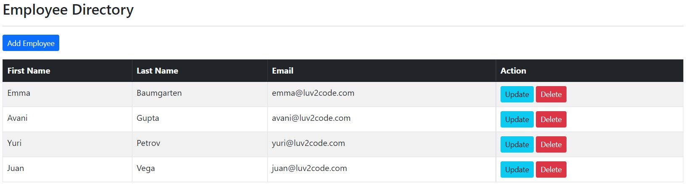
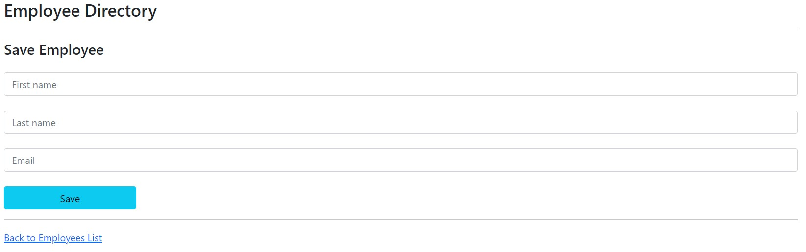
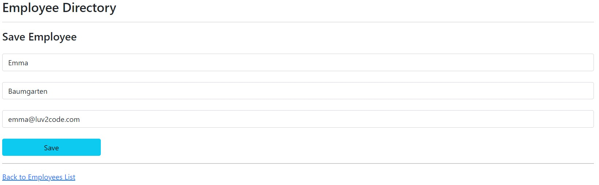
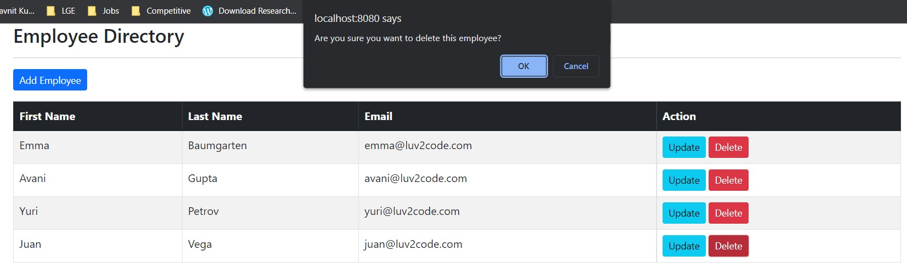

# Introduction
- This is kinda my `hello-world` into spring-boot.
- Basic CRUD project to create an employee table and fetch their details.
- Based on `Springboot`,`Hibernate-JPA` and `PostgreSQL`. 
- Frontend based templating is done with the help of `Thymeleaf`.  

# Setup
- Use [Neon](https://neon.com) or something similar to setup the remote PostgreSQL-DB.
- You can fill credentials in [application.properties](./employee_crud/src/main/resources/application.properties)
- Or you can create an `.env.local` in the Project Root Directory (same level as `pom.xml`).
- Run the server using the `mvn clean && mvn compile && mvn spring-boot:run`. 
- Server runs on `localhost:8080`.
  
### List Employee
## Operations

### Add Employee Page 

### Update Employee

### Delete Employee

